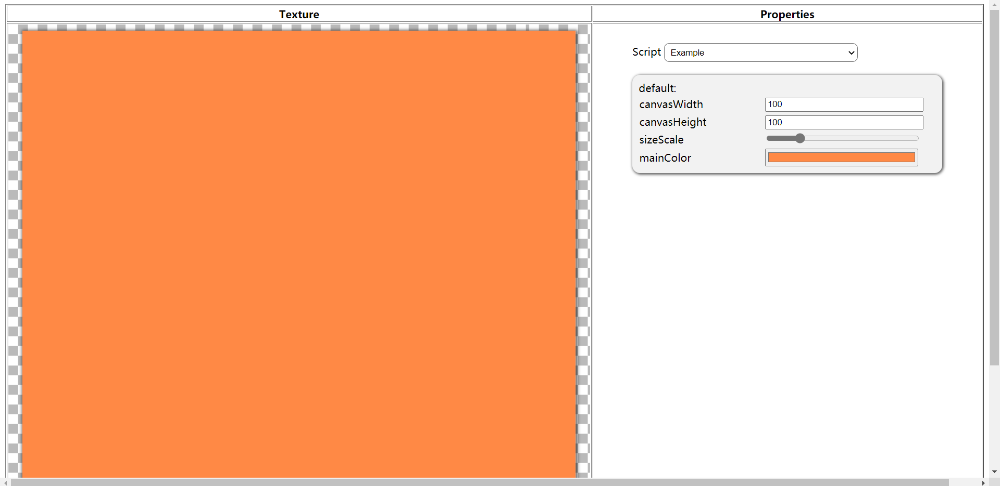
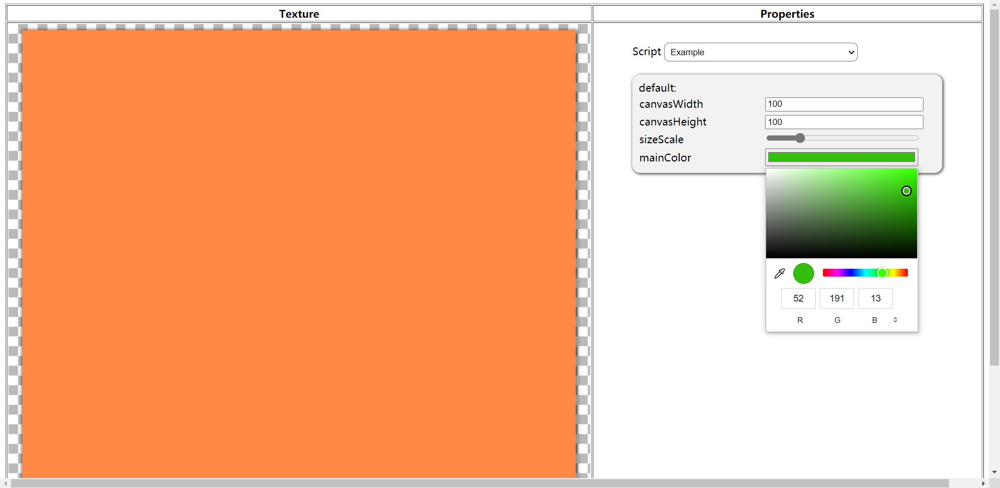
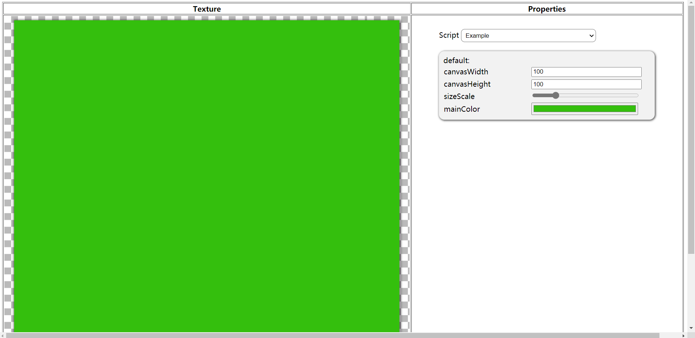
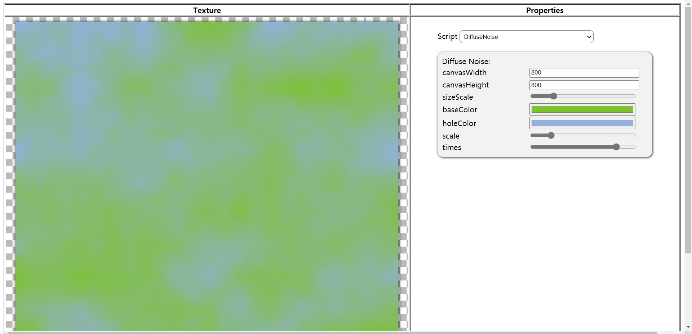

# WebTextureShaderLab
一个基于web技术的2D shader框架，使用多线程软渲染。实现了基于js语法的简易片元着色器；实现了Shader脚本参数可视化面板；支持自定义着色器。

## 自定义着色器 Write Shader
在graphicsScripts目录下新建一个js脚本文件，编写继承自Momo类的着色器子类：
```
class Example extends Momo {
	constructor() {
		super();
		this.mainColor = new D2dColor("#FF8945");
		
		this.frag = `
			return new D2dColor(tool.color); 
		`; // 'tool' is a object created with 'this.start' as a construct function.
		
		this.start = `
			this.color = momo.mainColor;
		`; // 'momo' is a object containing all d2d attributes of 'Example'. It also can be used in 'frag' function.
	}
}

```
##### 注意：着色器子类类名和脚本文件名必须一致，且一个脚本文件中应该只编写一个着色器子类。
修改js/select-list.js文件，添加新的着色器类名到着色器列表中（参照下面第5行）：
```
let scriptsRoot = "graphicsScripts/"
let scriptList = [
	"DemoNoise",
	"DemoGrid",
	"Example"
]
```
运行index.html页面，在右边着色器列表选择Example着色器：
 <br>

 <br>

 <br>

## 着色器的组合（Use More Than One Shader）
请看以下例子：
```
class DiffuseNoise extends Momo {
	constructor() {
		super();
		this.momoName = "Diffuse Noise";
		this.baseColor = new D2dColor("#FFFFFF");
		this.holeColor = new D2dColor("#000000");
		this.scale = new D2dRange(1, 30, 10);
		this.times = new D2dRange(2, 32, 8);
		this.frag = `
			let col = new D2dColor(momo.baseColor);
			let col2 = new D2dColor(momo.holeColor);
			let dark = tool.noise(x, y, momo, tool.noiseStart).R();
			return colorLerp(col, col2, dark / 255);
		`;
		this.start = `
			this.noise = new Function("x", "y", "momo", "tool", new DemoNoise().frag);
			let noiseStart = new Function("momo", new DemoNoise().start);
			this.noiseStart = new noiseStart(momo);
		`;
	}
}
```
在需要使用多个其他着色器的着色器的‘start’代码段中为‘tool’对象设置需要的其他着色器，这分为实例化其他着色器的‘frag’函数和实例化其他着色器的‘tool’对象（先使用其他着色器的‘start’对象实例化构造函数）。<br>
在这个例子中，本着色器需要使用噪声着色器，所以在‘start’代码段中，我们为tool声明了noise属性，它是噪声着色器的frag函数；我们又实例化了noiseStart函数，它是噪声着色器的tool对象的构造函数，使用它构造了本着色器tool对象的noiseStart。<br>
接下来，正如frag代码段中的内容，我们调用tool中noise函数，即噪声着色器的frag函数，生成了我们需要的噪声信息。
##### 注意：因为需要在控制面板调节噪声参数，本着色器的参数设置需要包含噪声所需要的所有参数，以便噪声着色器frag函数的momo参数能够正确获取需要的噪声参数。同时，噪声着色器frag函数需要的tool参数应该使用本着色器start代码段中设置的noiseStart，即噪声着色器自己的tool对象。
 <br>
