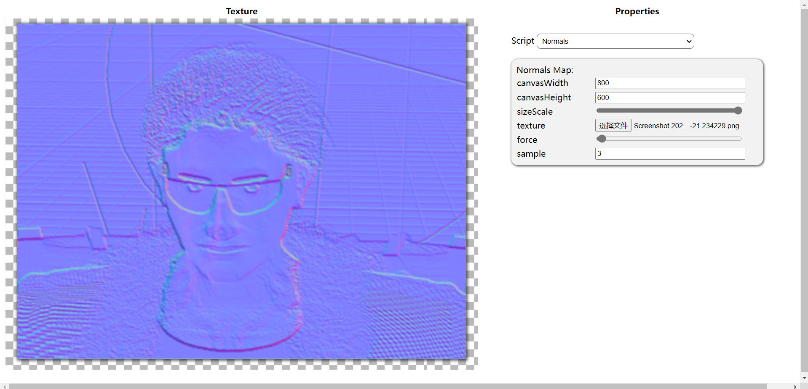

# WebTextureShaderLab
一个基于web技术的2D shader框架（非WebGL，WebGL版本未来将作为新项目开放），使用多线程软渲染。实现了基于js语法的简易片元着色器；实现了Shader脚本参数可视化面板；支持自定义着色器。
访问 [GitHub Page](https://luncybloont.github.io/WebTextureShaderLab/)

<br>

## 自定义着色器 Write Shader
在graphicsScripts目录下新建一个js脚本文件，编写继承自Momo类的着色器子类：
```
class Example extends Momo {
	constructor() {
		super();
		this.mainColor = new D2dColor("#FF8945");
		
		this.frag = `
			return new D2dColor(tool.color); 
		`; // 'tool' is a object created with 'this.start' as a construct function.
		
		this.start = `
			this.color = momo.mainColor;
		`; // 'momo' is a object containing all d2d attributes of 'Example'. It also can be used in 'frag' function.
	}
}

```
##### 注意：着色器子类类名和脚本文件名必须一致，且一个脚本文件中应该只编写一个着色器子类。
修改js/select-list.js文件，添加新的着色器类名到着色器列表中（参照下面第5行）：
```
let scriptsRoot = "graphicsScripts/"
let scriptList = [
	"DemoNoise",
	"DemoGrid",
	"Example"
]
```
运行index.html页面，在右边着色器列表选择Example着色器：<br>
 <br>

 <br>

 <br>

## 着色器的组合（Use More Than One Shader）
请看以下例子：
```
class DiffuseNoise extends Momo {
	constructor() {
		super();
		this.momoName = "Diffuse Noise";
		this.baseColor = new D2dColor("#FFFFFF");
		this.holeColor = new D2dColor("#000000");
		this.scale = new D2dRange(1, 30, 10);
		this.times = new D2dRange(2, 32, 8);
		this.frag = `
			let col = new D2dColor(momo.baseColor);
			let col2 = new D2dColor(momo.holeColor);
			tool.noiseMomo.scale = momo.scale;
			tool.noiseMomo.times = momo.times;
			let dark = tool.noise(x, y, tool.noiseMomo, tool.noiseStart).R();
			return colorLerp(col, col2, dark / 255);
		`;
		this.start = `
			this.noise = new Function("x", "y", "momo", "tool", new DemoNoise().frag);
			let noiseStart = new Function("momo", new DemoNoise().start);
			this.noiseStart = new noiseStart(momo);
			this.noiseMomo = getMomoObj(new DemoNoise());
		`;
	}
}
```
 <br>
